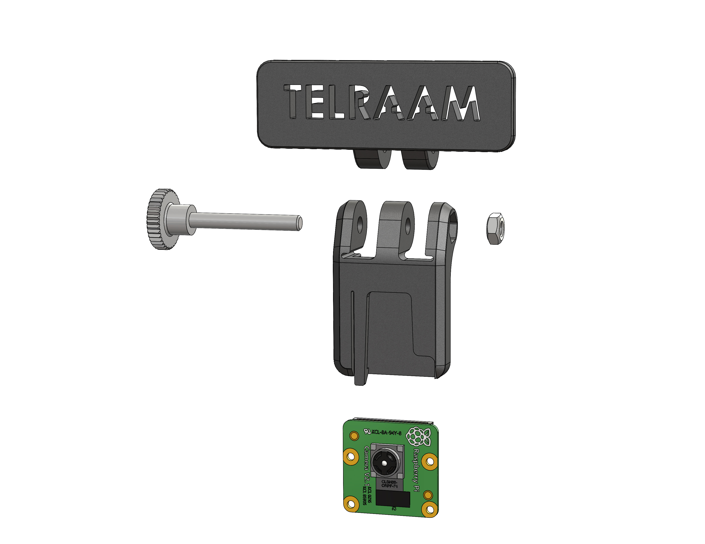

# TELRAAM CAMERA MOUNT FOR RASPBERRY PI 

This is a 3D printed case for the Telraam Raspberry Pi camera

This ensures that the camera can be installed at a perfect angle without the risk of falling out of position. Existing camera holders can be easily replaced. The 3D files for both 3D print parts can be found here.

You can order a printed version through goTron https://www.gotron.be/telraam-camerahouder-voor-telraam-sensoren.html

### Screw and nut
Knurled thumb screw: https://www.fabory.com/en_GB/knurled-thumb-screw-high-type-din-464-free-cutting-steel-zinc-plated/p/16650

Hexagon nut: https://www.fabory.com/en_GB/hexagon-nut-din-934-steel-zinc-plated-%7c8%7c-m4/p/01300040001

### Built by:
https://telraam.net

https://www.comate.be

### Questions
support@telraam.net